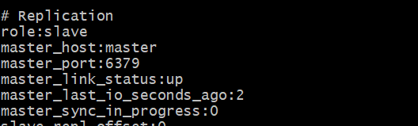
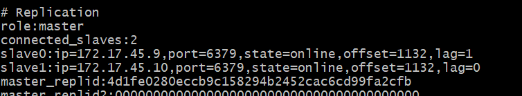
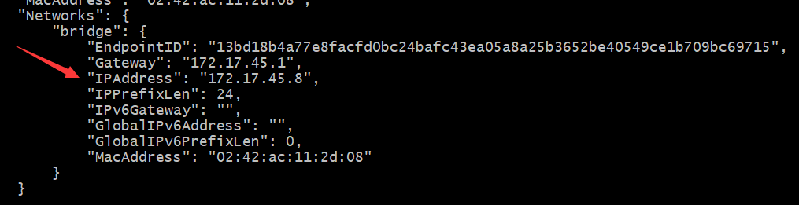
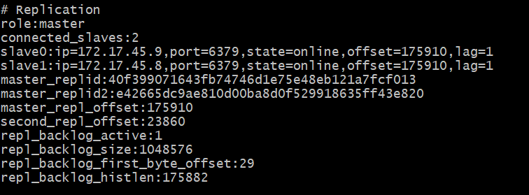

本次所有操作在docker下进行，搭建方便，迅速构建redis集群。

#### 1. docker安装redis
-  获取redis:latest（使用官方最新的） 镜像
```
$ docker pull redis
```
- redis.conf、sentinel.conf 配置

    官方下载

    http://download.redis.io/redis-stable/redis.conf

    http://download.redis.io/redis-stable/sentinel.conf


- redis安装(一主二从)

    容器外目录位置 /vagrant/app/redis

    redis.conf复制三份，分别为redis-master、redis-slave1、redis-salve2；

    sentinel.conf复制三份，分别为sentinel-master、sentinel-slave1、sentinel-slave2；

```
$ docker run -it -v /vagrant/app/redis/redis.conf:/usr/local/etc/redis/redis.conf -v /vagrant/app/redis/sentinel-master.conf:/usr/local/etc/redis/sentinel.conf  --name redis-master -p 6379:6379 -d redis
$ docker run -it  -v /vagrant/app/redis/redis-slave1.conf:/usr/local/etc/redis/redis.conf -v /vagrant/app/redis/sentinel-slave1.conf:/usr/local/etc/redis/sentinel.conf --link redis-master:master --name redis-slave1 -p 6380:6379 -d redis
$ docker run -it -v /vagrant/app/redis/redis-slave2.conf:/usr/local/etc/redis/redis.conf -v /vagrant/app/redis/sentinel-slave2.conf:/usr/local/etc/redis/sentinel.conf --link redis-master:master --name redis-slave2 -p 6381:6379 -d redis
```
-v 参数用于将宿主机上的某个目录挂载到容器中

--link redis-master:master参数，前面提到的redis-slave.conf配置文件中slaveof配置项，这里使用了一个master作为别名，其效果和使用IP一样（IP地址在/etc/host文件中）。

### 2. redis集群，配置主从复制

    分别进入三台redis容器内(docker exec -it 容器id /bin/bash)，redis-cli 连接redis服务端；

    连接后，使用info replication 查看当前机器角色，都为master主机；

    在redis-slave1、redis-slave2下，使用 SALVEOF master 6379 命令，建立主从联系；再次使用 info replication查看当前role



    并且master主机可以看到连接connectd-slaves:2,主从配置成功。

 

    redis-master主机下，执行 set sun 111,可以看到slave1、slave2能 get sun,返回结果  111；


### 3. 添加哨兵

    三台redis容器服务器，互相启动一个redis哨兵。

    查看容器ip，docker inspect <容器id>
```
docker inspect redis-master
```


分别对sentinel-master.conf、sentinel-slave1.conf、sentinel-slave2.conf,编辑修改：
```
sentinel monitor redis-master 172.17.45.8 6379 2
##其余mymaster的地方统一修改为 redis-master
```


分别进入容器内，执行如下命令：

```
redis-sentinel /usr/local/etc/redis/sentinel.conf
```

### 4. 检测

    dockers ps -a  可以看到三个正在运行的redis服务器

    dockers stop redis-master 停止redis-master服务再启动，打开容器redis-slave1(可能redis-slave2)，执行redis-cli，info查看：


    
    可以看到，redis-slave1已升级为master